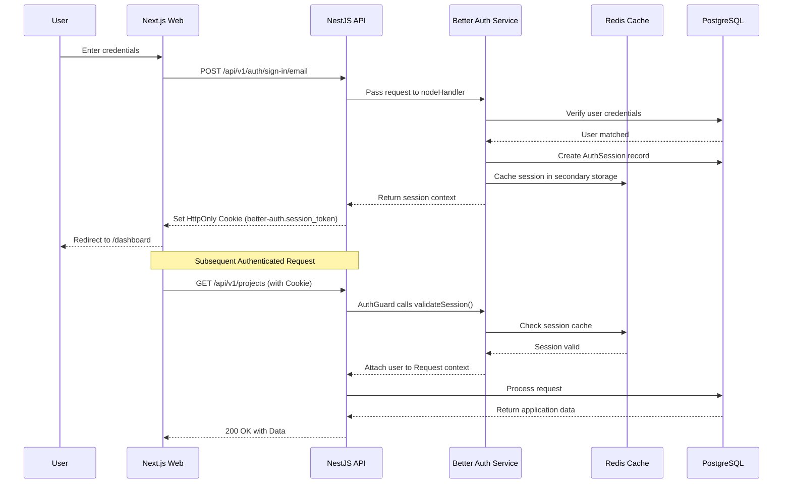

# Authentication Architecture

Atlas ERP uses [Better Auth](https://better-auth.com/) as its core authentication provider, replacing legacy passport-based strategies for a more modern, secure, and flexible solution.

## Core Concepts

Better Auth provides a comprehensive set of features out-of-the-box:
- **Stateful Sessions:** Stored in PostgreSQL via Prisma with `storeSessionInDatabase: true`.
- **Secondary Storage Caching:** Integrated with Redis to accelerate session validation and manage OTP cooldowns.
- **OAuth Providers:** Easy integration with Google, Microsoft, GitHub, etc.
- **Two-Factor Authentication (2FA):** Support for TOTP via authenticator apps.
- **Magic Links & Email OTP:** Passwordless login options and email verification workflows.

## Authentication Flow



## Integrating with NestJS

While Better Auth handles the token generation and validation, NestJS enforces the protection on routes using Guards.

### The `AuthGuard`

Routes that require a logged-in user use the standard NestJS `AuthGuard`.

```typescript
// apps/api/src/common/guards/auth.guard.ts
import { Injectable, CanActivate, ExecutionContext, UnauthorizedException } from '@nestjs/common';
import { Reflector } from '@nestjs/core';
import { BetterAuthService } from '../../auth/services/better-auth.service';
import { IS_PUBLIC_KEY } from '../../auth/decorators/public.decorator';

@Injectable()
export class AuthGuard implements CanActivate {
  constructor(
    private reflector: Reflector,
    private betterAuthService: BetterAuthService
  ) {}

  async canActivate(context: ExecutionContext): Promise<boolean> {
    const isPublic = this.reflector.getAllAndOverride<boolean>(IS_PUBLIC_KEY, [
      context.getHandler(),
      context.getClass(),
    ]);
    
    if (isPublic) return true;

    const request = context.switchToHttp().getRequest();
    
    try {
      const session = await this.betterAuthService.validateSession(request);
      if (!session) throw new UnauthorizedException();
      
      // Attach user to request for downstream controllers/guards
      request.user = session.user;
      return true;
    } catch (e) {
      throw new UnauthorizedException('Invalid or expired session');
    }
  }
}
```

## Security Measures

1. **HttpOnly Cookies:** Tokens are typically stored in HttpOnly, Secure cookies to mitigate Cross-Site Scripting (XSS) attacks.
2. **CSRF Protection:** Tokens submitted via headers or body (if not using cookies) are validated against CSRF tokens.
3. **Rate Limiting:** Login, registration, and password reset endpoints are strictly rate-limited using `ThrottlerGuard` to prevent brute-force attacks.
4. **CAPTCHA:** Registration and sensitive actions are protected by Cloudflare Turnstile (`TurnstileGuard`).