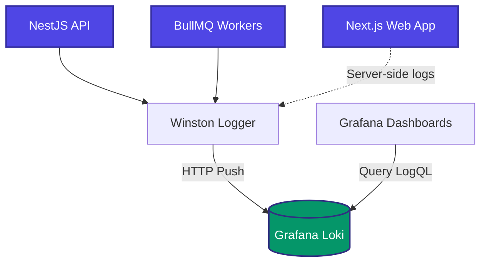

# Observability & Monitoring

Monitoring a cloud-native ERP system is critical for maintaining uptime and quickly diagnosing issues. Atlas ERP provides an optional, but highly recommended, integration with the Grafana observability stack.

## The Observability Stack

We use the "LGTM" stack, primarily focusing on **Loki** for logs and **Grafana** for visualization.

| Tool | Purpose |
|------|---------|
| **[Grafana](https://grafana.com/)** | Visualization dashboard for logs, metrics, and traces. |
| **[Loki](https://grafana.com/oss/loki/)** | Log aggregation system designed to be cost-effective and highly scalable. |
| **[Prometheus](https://prometheus.io/)** | (Optional) Metrics aggregation for deep infrastructure insights. |

## Architecture



## Logging Implementation

In the NestJS backend, we use `winston` as the custom logger. Winston is configured to write to the console (for local development) and stream logs directly to Loki (for production).

### Winston Configuration

```typescript
// apps/api/src/common/config/winston.config.ts
import * as winston from 'winston';
import LokiTransport from 'winston-loki';

const transports: winston.transport[] = [
  new winston.transports.Console({
    format: winston.format.combine(
      winston.format.timestamp(),
      winston.format.colorize(),
      winston.format.simple()
    )
  })
];

if (process.env.LOKI_ENABLED === 'true') {
  transports.push(
    new LokiTransport({
      host: process.env.LOKI_URL,
      basicAuth: `${process.env.LOKI_USER}:${process.env.LOKI_PASSWORD}`,
      labels: { app: 'atlas-api', env: process.env.NODE_ENV },
      json: true,
      format: winston.format.json(),
      replaceTimestamp: true,
      onConnectionError: (err) => console.error('Loki error', err)
    })
  );
}

export const winstonConfig = {
  transports,
};
```

## Structured Logging

Logs are formatted as JSON before being sent to Loki. This allows for powerful querying using LogQL.

**Bad Log:**
```text
User 123 failed to login from IP 1.2.3.4
```

**Good Log (Structured):**
```json
{
  "message": "Authentication failed",
  "userId": "123",
  "ip": "1.2.3.4",
  "action": "login",
  "status": "failed",
  "level": "warn",
  "timestamp": "2026-06-11T12:00:00Z"
}
```

By using structured logging, you can create Grafana alerts like:
`Count of {app="atlas-api"} |= "Authentication failed" > 50 in 5m`