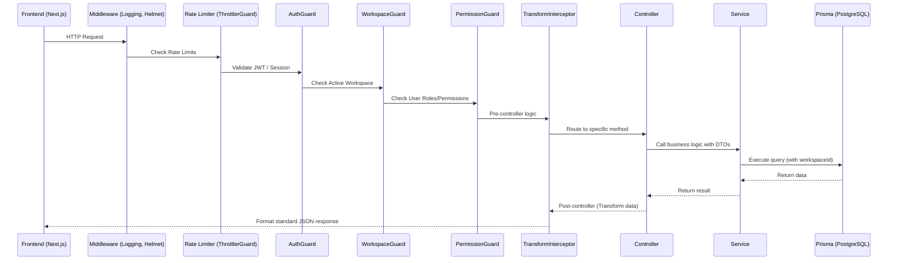

# Request Lifecycle

Understanding the path an HTTP request takes through the Atlas ERP backend helps in debugging and developing new features. The backend is built on NestJS 11, which follows a strict, predictable lifecycle.

## The Flow



## Step-by-Step Breakdown

### 1. Middleware
The request hits global middleware first. This includes:
- **CORS:** Cross-Origin Resource Sharing rules.
- **Helmet:** Security headers.
- **LoggerMiddleware:** Logs the incoming request method and URL.

### 2. Guards
Guards determine if the request is authorized to proceed.
- **ThrottlerGuard:** Prevents brute-force and DDoS attacks by limiting requests per IP.
- **AuthGuard:** Verifies the Better Auth token. If valid, attaches the `user` object to the request.
- **WorkspaceGuard:** Ensures the user has selected a valid workspace context.
- **PermissionGuard:** (Optional) Checks if the user has specific roles or abilities (e.g., `create:invoice`) using CASL or role-based logic.

### 3. Interceptors (Pre-Controller)
Interceptors can mutate the request before it hits the controller.
- **AuditInterceptor:** May log the start time of the request for performance tracking.

### 4. Pipes (Validation)
Pipes transform and validate incoming data (Request Body, Query Params).
- **ValidationPipe:** Uses `class-validator` and `class-transformer` to ensure the incoming payload matches the defined DTO (Data Transfer Object). If validation fails, it throws a `400 Bad Request` immediately.

### 5. Controller
The Controller receives the validated payload. Its job is purely orchestrational:
- Extract parameters, body, and user context.
- Pass them to the appropriate Service method.

### 6. Service & Repository
The Service contains the core business logic.
- Processes the data.
- Enforces multi-tenancy by including `workspaceId` in queries.
- Interacts with the database via Prisma.

### 7. Interceptors (Post-Controller)
Once the service returns data, interceptors can transform the outgoing response.
- **TransformInterceptor:** Wraps all successful responses in a standard JSON format:
  ```json
  {
    "success": true,
    "data": { ... }
  }
  ```

### 8. Exception Filters
If an error occurs anywhere in the lifecycle (e.g., a `NotFoundException` in the service, or a database constraint error), the `AllExceptionFilter` catches it, logs it, and formats a standard error response:
  ```json
  {
    "success": false,
    "error": {
      "statusCode": 404,
      "message": "Project not found"
    }
  }
  ```