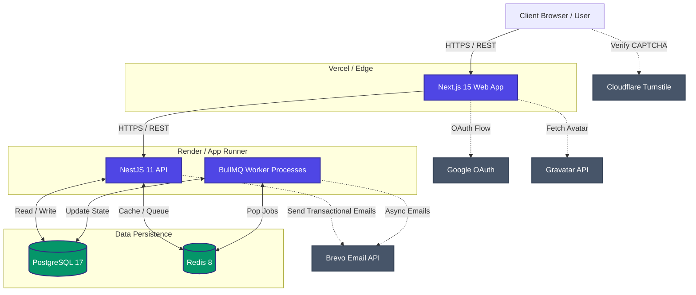

# System Diagram

The following diagram illustrates the high-level architecture of Atlas ERP, showing the flow of data between the user, frontend, backend, and external services.

## Component Roles

- **Next.js Web App:** Renders the UI, manages client-side state, and proxies user interactions to the backend API.
- **NestJS API:** The core monolithic API that enforces business rules, handles authentication (Better Auth), and executes complex logic.
- **PostgreSQL:** The source of truth for all business data, including multi-tenant ERP records, users, and roles.
- **Redis:** Handles fast in-memory caching, session management for Better Auth, rate limiting data, and queue storage.
- **BullMQ Workers:** Asynchronous processors that handle tasks like report generation, bulk data imports, and email dispatching without blocking the main API thread.
- **External Services:** Provide specialized capabilities like CAPTCHA verification, SSO, profile images, and email delivery.