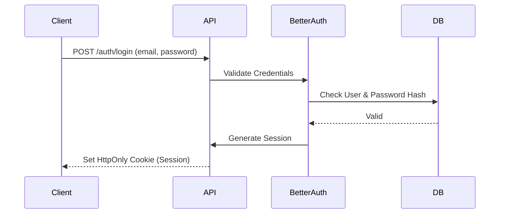
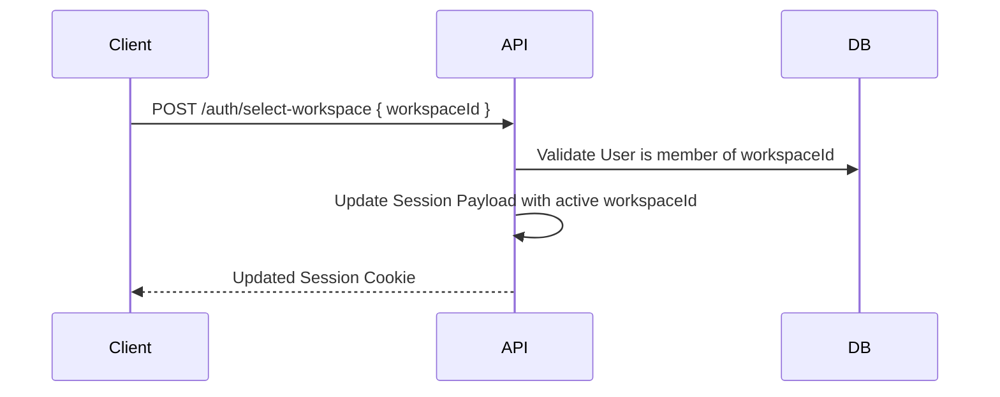

# Auth Module

## Purpose
The Auth module is the core security perimeter of Atlas ERP. It handles user registration, login, session management, password resets, and integrates tightly with Better Auth.

## Responsibilities
- User Registration and Email Verification
- Login (Email/Password, OAuth, Magic Links)
- Session Management (stateful sessions via Better Auth, caching in Redis)
- Password Reset flows
- Providing the custom `AuthGuard` and `WorkspaceGuard`
- CAPTCHA validation via Cloudflare Turnstile

## File Structure
```
apps/api/src/auth/
├── auth.module.ts
├── auth.controller.ts
├── auth.service.ts
├── better-auth.controller.ts
├── config/
│   ├── auth.config.ts
│   └── google-oauth.config.ts
├── decorators/
│   ├── current-user.decorator.ts
│   ├── public.decorator.ts
│   └── workspace.decorator.ts
├── dto/
│   ├── login.dto.ts
│   ├── register.dto.ts
│   ├── reset-password.dto.ts
│   └── select-workspace.dto.ts
├── guards/
│   ├── permission.guard.ts
│   ├── project-role.guard.ts
│   ├── roles.guard.ts
│   └── workspace.guard.ts
├── plugins/
│   └── turnstile.plugin.ts
└── services/
    ├── auth-utils.service.ts
    ├── better-auth.service.ts
    ├── casl-ability.factory.ts
    ├── google-oauth.service.ts
    └── permissions.service.ts
```

## Database Models
*(Models managed by Better Auth plugin)*
- `AuthUser`
- `AuthSession`
- `AuthAccount`
- `AuthVerification`

## Key Flows

### Standard Login



### Selecting a Workspace

Because Atlas is multi-tenant, after login, a user must select which workspace they want to operate in.

