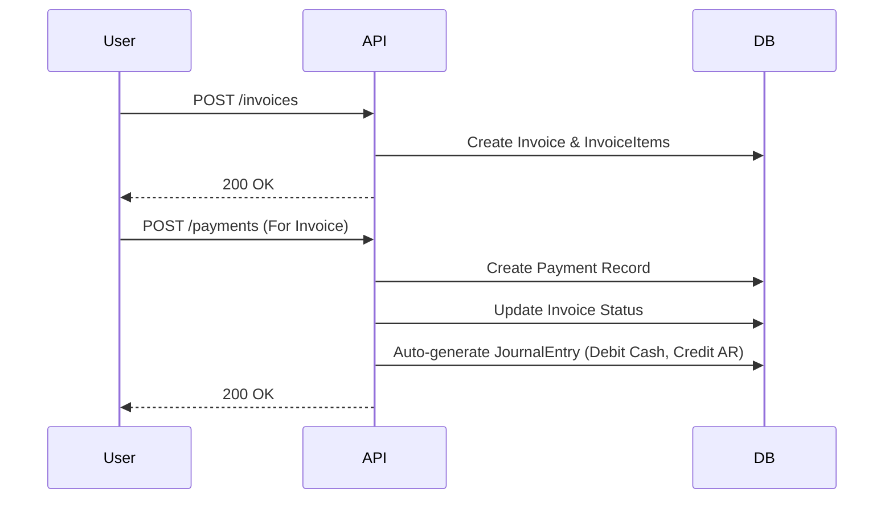

# Finance Module

## Purpose
The Finance module handles all accounting and financial operations for a workspace, including chart of accounts, invoicing, journal entries, and financial reporting.

## Responsibilities
- Managing the Chart of Accounts
- Creating and tracking Invoices and Payments
- Double-entry accounting via Journal Entries
- Generating financial reports (Balance Sheet, Profit & Loss)
- Managing Fiscal Periods

## File Structure
```
apps/api/src/finance/
├── finance.module.ts
├── finance-setup.controller.ts
├── accounts/
│   ├── accounts.controller.ts
│   ├── accounts.service.ts
│   └── dto/
├── invoices/
│   ├── invoices.controller.ts
│   ├── invoices.service.ts
│   └── dto/
├── journals/
│   ├── journals.controller.ts
│   ├── journals.service.ts
│   └── dto/
├── payments/
│   ├── payments.controller.ts
│   ├── payments.service.ts
│   └── dto/
├── periods/
│   ├── periods.controller.ts
│   └── periods.service.ts
└── reports/
    ├── reports.controller.ts
    └── reports.service.ts
```

## Key Files
| File | Purpose |
|------|---------|
| `finance.module.ts` | Orchestrates all sub-modules (accounts, invoices, etc.) |
| `journals.service.ts` | Enforces double-entry accounting rules (debits = credits) |
| `reports.service.ts` | Aggregates journal lines to calculate P&L and Balance Sheets |

## Database Models
- `FinancialAccount`
- `JournalEntry`
- `JournalEntryLine`
- `Invoice`
- `InvoiceItem`
- `Payment`
- `FiscalPeriod`

## API Endpoints
- `GET /api/v1/finance/accounts`
- `POST /api/v1/finance/accounts`
- `GET /api/v1/finance/invoices`
- `POST /api/v1/finance/invoices`
- `GET /api/v1/finance/journals`
- `POST /api/v1/finance/journals`
- `GET /api/v1/finance/reports/balance-sheet`
- `GET /api/v1/finance/reports/profit-loss`

## Key Flows

