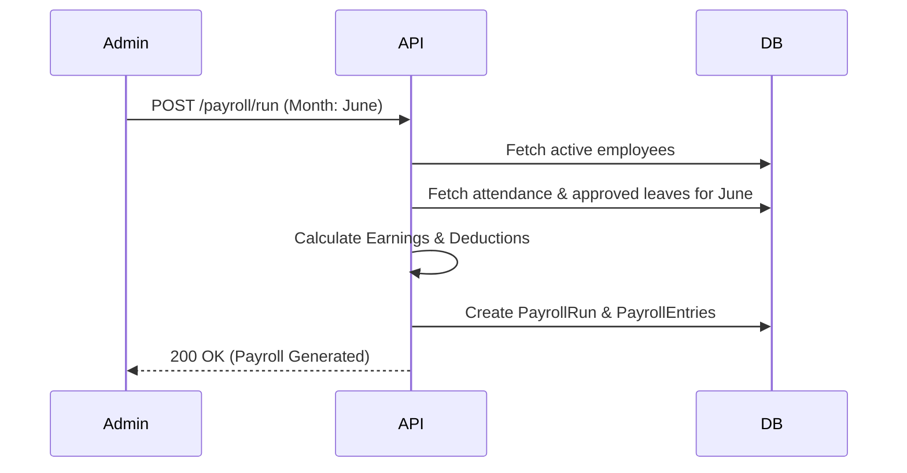

# HR Module

## Purpose
The Human Resources module manages employee lifecycles, attendance tracking, leave requests, and complex payroll calculations.

## Responsibilities
- Managing Employee profiles and records
- Tracking daily Attendance and Shift assignments
- Processing Leave Applications and managing Leave Ledgers
- Calculating and generating Payroll runs
- Managing onboarding and offboarding activities

## File Structure
```
apps/api/src/hr/
├── hr.module.ts
├── hr.controller.ts
├── hr.service.ts
└── seed-india.ts
```
*(Note: As the module grows, it should be refactored into sub-directories like the Finance module)*

## Database Models
- `Employee`
- `Department`
- `Designation`
- `Attendance`
- `LeaveType`
- `LeaveApplication`
- `LeaveLedgerEntry`
- `PayrollRun`
- `PayrollEntry`
- `SalaryStructure`

## API Endpoints
- `GET /api/v1/hr/employees`
- `POST /api/v1/hr/employees`
- `GET /api/v1/hr/attendance`
- `POST /api/v1/hr/leaves`
- `POST /api/v1/hr/payroll/run`

## Key Flows

