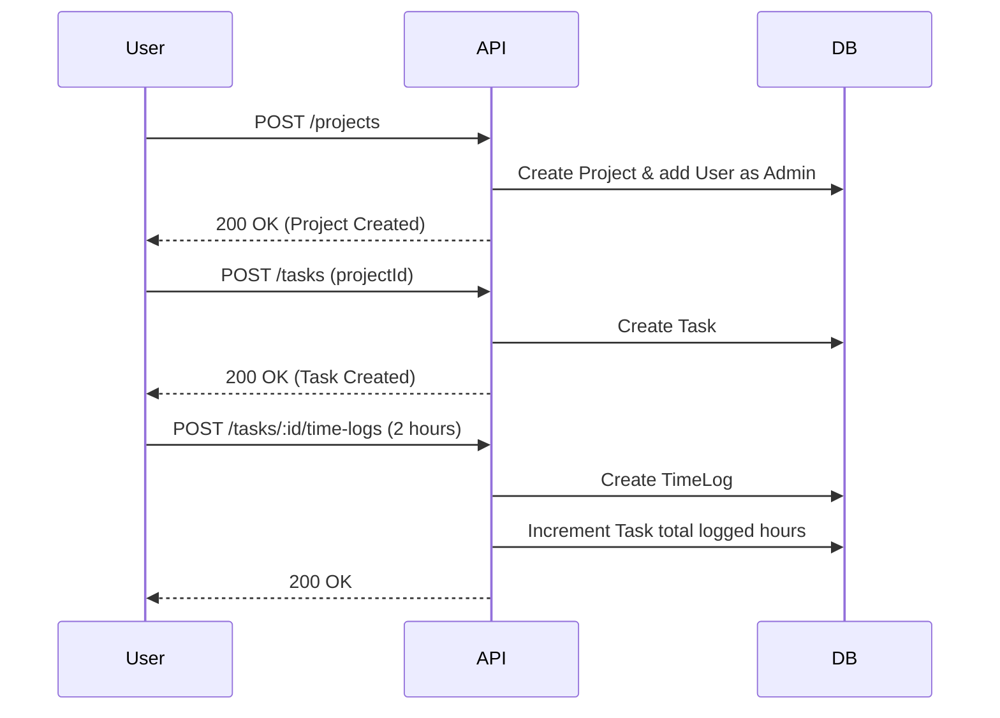

# Project Module

## Purpose
The Project module manages the lifecycle of projects, tasks, milestones, and time tracking, enabling teams to collaborate and deliver work effectively within a workspace.

## Responsibilities
- Managing Projects and their statuses (e.g., Active, On Hold, Completed)
- Creating and assigning Tasks to Workspace Members
- Defining and tracking Milestones
- Logging time spent on specific tasks (Time Logs)

## File Structure
```
apps/api/src/project/
├── project.module.ts
├── projects/
│   ├── projects.controller.ts
│   ├── projects.service.ts
│   ├── projects.service.spec.ts
│   └── dto/
│       ├── create-project.dto.ts
│       ├── update-project.dto.ts
│       └── project-member.dto.ts
├── tasks/
│   ├── tasks.controller.ts
│   ├── tasks.service.ts
│   ├── tasks.service.spec.ts
│   └── dto/
│       ├── create-task.dto.ts
│       ├── update-task.dto.ts
│       └── create-time-log.dto.ts
└── milestones/
    ├── milestones.controller.ts
    ├── milestones.service.ts
    ├── milestones.service.spec.ts
    └── dto/
        ├── create-milestone.dto.ts
        └── update-milestone.dto.ts
```

## Database Models
- `Project`
- `Task`
- `Milestone`
- `TaskAssignment`
- `ProjectMember`
- `TimeLog`

## API Endpoints
- `GET /api/v1/projects`
- `POST /api/v1/projects`
- `GET /api/v1/projects/:id`
- `PATCH /api/v1/projects/:id`
- `GET /api/v1/tasks`
- `POST /api/v1/tasks`
- `PATCH /api/v1/tasks/:id`
- `POST /api/v1/tasks/:id/time-logs`
- `GET /api/v1/milestones`
- `POST /api/v1/milestones`

## Key Flows

