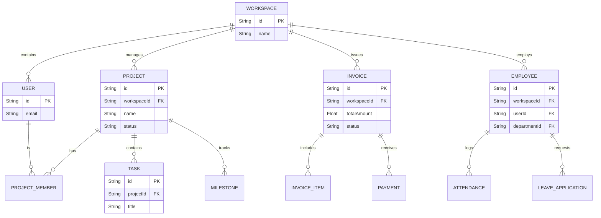

# Database Schema

Atlas ERP manages its database schema using Prisma (`packages/database/prisma/schema.prisma`).

## ER Diagram (Core Entities)

The following diagram shows the high-level relationships between the core entities in the system.



## Schema Structure

The Prisma schema is logically grouped into modules:

### 1. Authentication & Security
Entities required by Better Auth and our RBAC system.
- `AuthUser`, `AuthSession`, `AuthAccount`
- `Role`, `Permission`, `RolePermission`

### 2. Core (Multi-Tenancy)
- `Workspace`: The primary tenant boundary.
- `WorkspaceMember`: Links a `User` to a `Workspace` with a specific `Role`.

### 3. Human Resources (HR)
- `Employee`, `Department`, `Designation`
- `Attendance`, `LeaveApplication`, `LeaveType`
- `PayrollRun`, `PayrollEntry`

### 4. Finance & Accounting
- `FinancialAccount` (Chart of Accounts)
- `JournalEntry`, `JournalEntryLine` (Double-entry accounting)
- `Invoice`, `Payment`

### 5. Projects & Tasks
- `Project`, `Milestone`, `Task`, `TimeLog`

## Multi-Tenancy Implementation

Almost every model in the schema (except core Auth models) contains a `workspaceId` field.

```prisma
model Task {
  id          String    @id @default(uuid())
  title       String
  description String?
  status      String    @default("TODO")
  
  // Relationships
  projectId   String
  project     Project   @relation(fields: [projectId], references: [id], onDelete: Cascade)
  
  // Multi-Tenancy Boundary
  workspaceId String
  workspace   Workspace @relation(fields: [workspaceId], references: [id], onDelete: Cascade)

  @@index([workspaceId])
  @@index([projectId])
}
```

**Important Note:** The `@onDelete: Cascade` directive on the `workspace` relationship ensures that if a Workspace is deleted, all its associated data (tasks, invoices, projects) is immediately wiped from the database.